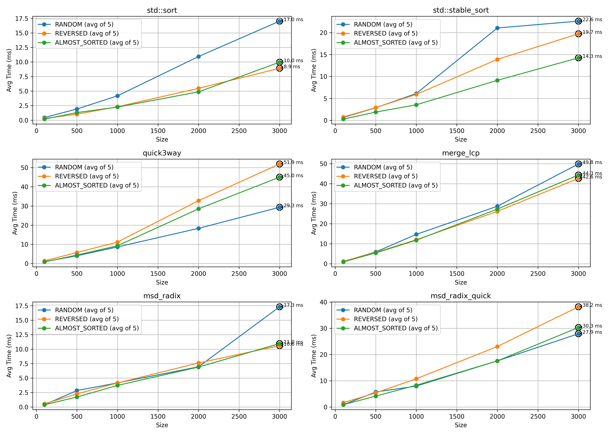

A1 

Лившиц Леонид Игоревич, 235

## Посылки:

* 321172074 

* 321161090

* 321158493


## Проект

* **StringGenerator** :
  Генерирует пул из 3000 строк (длины 10-200) и на его основе выдаёт массив заданного размера: 
  случайный, обратно отсортированный, почти отсортированный (2-5% перестановок).

* **SortTester**:
  Запускает на каждой комбинации `(size, order)` по 5 замеров (и +5 для size=3000) каждого алгоритма и усредняет время. Результаты сохраняются в `results.csv` со столбцами

  ```
  Sorter,Size,Order,AvgTimeMs
  ```

* **Алгоритмы:**

  * `sort_string_quick_3way` - трёхсторонний STRING QUICK SORT (функции `stringQuick3Way` и обёртка).
  * `sort_string_merge_lcp` - MERGE SORT с оптимизацией по LCP (`mergeLCP`).
  * `sort_msd_radix` - базовый MSD-RADIX по 256-буквенному алфавиту (`msdRadix`).
  * `sort_msd_radix_quick` - MSD-RADIX с переключением на `stringQuick3Way` при размере сегмента < 74 (`msdRadixQuick`).
* **Стандартные алгоритмы**
  В `main.cpp` также сравниваются `std::sort` и `std::stable_sort`(если не ошибасюсь, это гибридная сортировка, а не merge sort, но я всё равно взял её).

---

## Анализ результатов




### 1. `std::sort`

* **RANDOM**: растёт почти линейно от 0.45 ms (n=100) до 17.0 ms (n=3000).
* **REVERSED**: от 0.28 ms до 8.9 ms.
* **ALMOST SORTED**: от 0.18 ms до 10.0 ms.
* Отличная адаптивность на обратно отсортированных и почти отсортированных, при random уступает чистому radix.

---

### 2. `std::stable_sort`

* **RANDOM**: от 0.65 ms до 22.6 ms (самая "тяжёлая" линия сверху).
* **REVERSED**: до 19.7 ms.
* **ALMOST SORTED**: до 14.3 ms.
* Стабильная сортировка значительно медленнее `std::sort` из-за лишней гарантии стабильности и глубокой рекурсии.

---

### 3. `quick3way` (тернарный String Quick Sort)

* **RANDOM**: от 0.92 ms до 29.3 ms.
* **REVERSED**: до 51.9 ms (резко растёт).
* **ALMOST SORTED**: до 45.0 ms.
* Плохо себя ведёт на REVERSED и ALMOST SORTED.

---

### 4. `merge_lcp` (Merge Sort с LCP)

* **RANDOM**: от 1.10 ms до 49.8 ms.
* **REVERSED**: до 42.6 ms.
* **ALMOST SORTED**: до 44.3 ms.
* Самое медленное среди всех; LCP-оптимизация даёт мало выигрыша по времени.

---

### 5. `msd_radix` (MSD-Radix без переключения)

* **RANDOM**: от 0.41 ms до 17.3 ms.
* **REVERSED**: до 11.0 ms.
* **ALMOST SORTED**: до 11.0 ms.
* Лучший специализированный алгоритм.

---

### 6. `msd_radix_quick` (MSD-Radix с переключением на Quick3Way при малых сегментах)

* **RANDOM**: от 0.88 ms до 27.9 ms.
* **REVERSED**: до 38.2 ms.
* **ALMOST SORTED**: до 30.3 ms.

---

## Выводы

1. **Лидер по скорости** среди всех тестов - `std::sort`:
   * Особенно выгоден на реверснутых и почти отсортированных данных (≤10 ms при n=3000).
   * На чисто случайных уступает radix, но выигрывает у остальных.

2. **MSD-Radix (без Quick)** - лучший из специализированных:
   * Быстрее `std::sort` на RANDOM.
   * Значительно быстрее на REVERSED и ALMOST SORTED.

3. **Тернарный QuickSort** (`quick3way`) работает плохо на почти отсортированных и обратно отсортированных.


